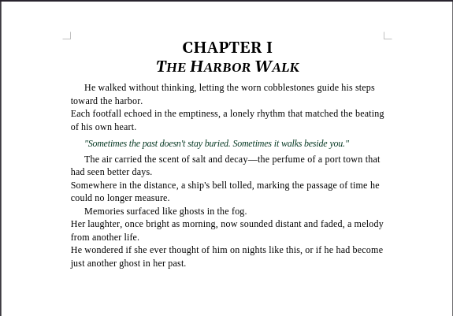
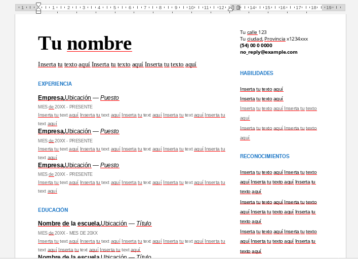
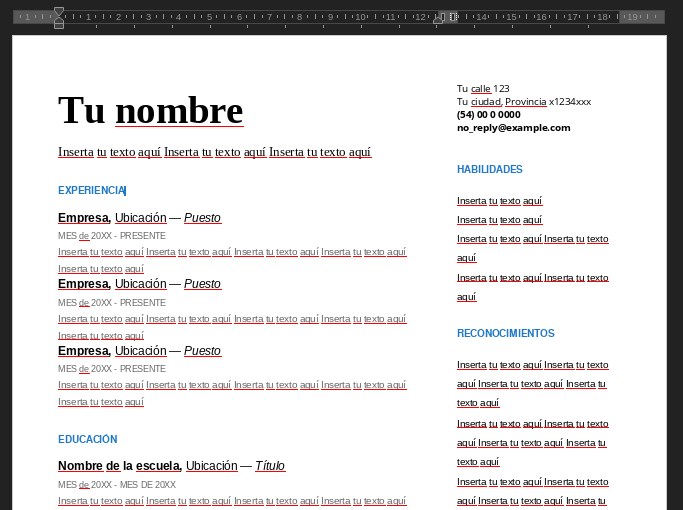
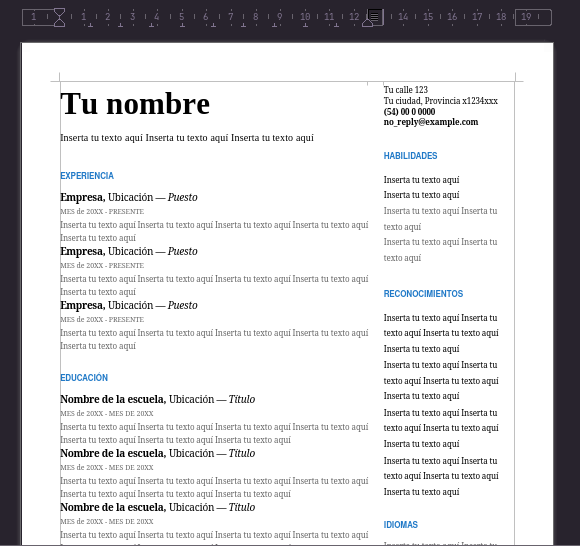
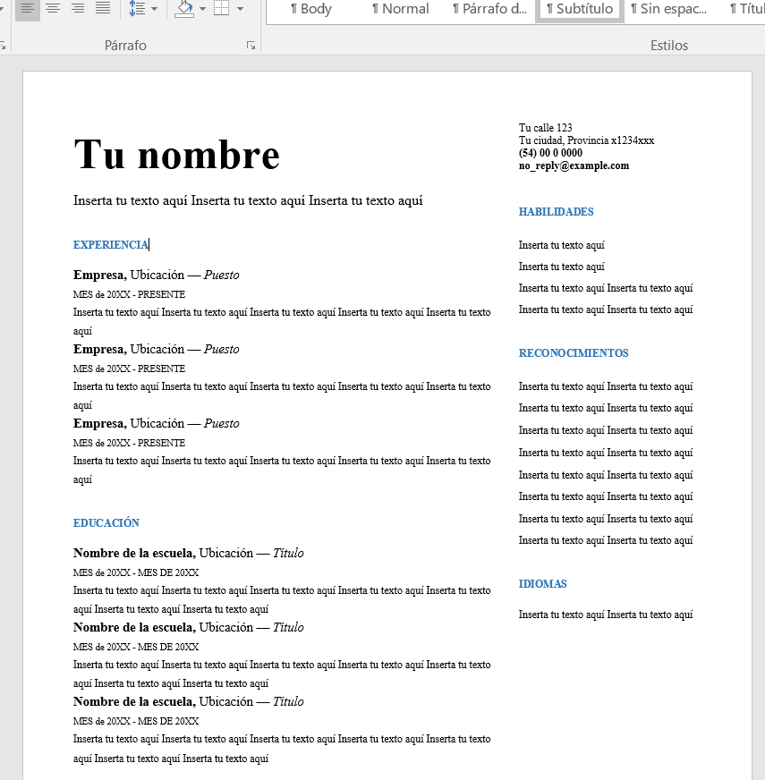
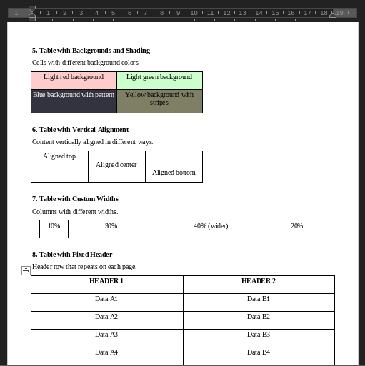

## Dart-DOCX: Easily generate .docx files with Dart

`docx` is a high-level, declarative API for generating Microsoft Word (.docx) documents using Dart.

Planned parsers include HTML, Markdown, plain text, and Quill Delta, enabling structured transformations between common content formats and Word documents while preserving document semantics.

> [!NOTE]
> * Additional format parsers are planned.
> * Incremental editing is planned but in a lorge term. 
> * Shape effects (e.g., shadows, gradients) are experimental at this points.

## Examples

The following documents were generated entirely using the `docx` declarative API.
Each example is available as runnable code under the `demos/` directory.

### Literary document


→ [novel.dart](https://github.com/Flutter-Document-Kit/dart-docx-toolkit/blob/master/demos/novel.dart)

## Curriculum

| Google Docs Template | Generated by our library |
|----------------------|--------------------------|
|  |  |

### Comparison details

| Feature | Google Docs Template | Our library output |
|---------|---------------------|--------------------|
| **Layout** | table with 2 columns layout | native multi-column layout |
| **Styling** | Consistent typography and spacing | Similar font families, sizes, and colors |
| **Content flow** | Logical section ordering | Very similar section structure |
| **Compatibility** | Google Docs format | Native .docx (MS Word compatible) |

#### Viewer compatibility
| Viewer | Screenshot | Notes |
|--------|------------|-------|
| **OnlyOffice** |  | Good fidelity with the template |
| **LibreOffice** |  | Good compatibility, minor spacing differences |
| **Microsoft Word** |  | minor differences |

→ [cv.dart](https://github.com/Flutter-Document-Kit/dart-docx-toolkit/blob/master/demos/cv.dart)

### Vector shapes (DrawingML)


→ [heart_shape.dart](https://github.com/Flutter-Document-Kit/dart-docx-toolkit/blob/master/demos/heart_shape.dart)
→ [heart_with_border.dart](https://github.com/Flutter-Document-Kit/dart-docx-toolkit/blob/master/demos/heart_with_border.dart)

### Tables


_Works on LibreOffice, but has some rendering issues. It's just a compatibility issue._

→ [tables.dart](https://github.com/Flutter-Document-Kit/dart-docx-toolkit/blob/master/demos/tables.dart)


## Key Features

*   **Programmatic DOCX Generation:** Create `.docx` files from scratch using an object-based Dart API.
*   **Rich Content Support:** Insert paragraphs, formatted text (bold, italic, etc.), images, hyperlinks, page breaks, text frames, and tables.
*   **Customizable Styles:** Define and apply custom paragraph and character styles to your content.
*   **Document Properties Management:** Configure metadata such as title, author, subject, and more with no efforts.
*   **Media Handling:** Images can be provided as raw bytes or files; relationships and media packaging are handled automatically.
*   **Stream-Based Generation Events:** Generate documents asynchronously and monitor progress via a `Stream` of events.

## Installation

Add `docx` to your `pubspec.yaml` file:

```yaml
dependencies:
  docx: ^latest_version
```

## Basic Usage

### 1. Define the Document Content

Your document content is structured using classes that extend `DocxContent` and `ComponentContainer`. `DocxDocument` is the, and within it you can add `Paragraph`s, `TextRun`s, `Image`s, `HyperlinkRun`s, etc.

Here is an example of how to create a simple document:

```dart
import 'dart:io';
import 'dart:typed_data';
import 'package:docx/docx.dart';

Future<void> main() async {
  final DocxDocument document = DocxDocument(
    options: DocumentOptions.standard(
      title: 'My First DOCX Document',
      creator: 'me',
      subject: 'example',
    ),
    root: DocumentRoot(
      sections: <DocxTreeNode<dynamic>>[
        Paragraph(
          data: <RunBase>[
            TextRun(
              data: TextPart(
                text: 'This is a paragraph with bold text. ',
                styles: <Object>[
                  // we can use styles and attributes together
                  // if we want
                  Style.reference('code'),
                  BoldAttribute(),
                ],
              ),
            ),
            HyperlinkRun(
              data: HyperlinkTextPart(
                hyperlink: 'https://github.com/your-user/your-repo',
                text: 'Visit my GitHub repository',
                styles: <Style>[Style.reference('Hyperlink')],
              ),
            ),
            TextRun(
              data: TextPart(text: ' and here the paragraph ends.'),
            ),
          ],
          styles: <Style>[],
          // decides where break the page
          pageBreak: ParagraphPageBreak.none,
        ),
        Paragraph(
          data: <RunBase>[
            TextRun(
              data: TextPart(text: 'Here is a line break.'),
            ),
          ],
        ),
        // loads and shows the image:
        // * if it exists
        // * if it can be used
        Paragraph(
          data: <RunBase<dynamic>>[
            Run(
              component: DrawingML(
                data: LazyFloatingImage(
                  data: ImageData(
                    buffer: File('test_resources/image.jpg'),
                    extension: 'jpg',
                    anchorConfig: AnchorConfig.block().copyWith(
                      horizontalAnchor: HorizontalAnchorPosition.paragraph,
                      horizontalPosition: AnchorPosition.left,
                      verticalAnchor: VerticalAnchorPosition.paragraph,
                      verticalPosition: AnchorPosition.top,
                    ),
                    width: 0.5.inchesToEmu(),
                    height: 0.55.inchesToEmu(),
                  ),
                ),
              ),
            ),
          ],
        ),
      ],
    ),
  );

  final File file = File('generated_document.docx');
  final Uint8List? bytes = await DocxPacker.instance
      .dynamicFontSearch(true)
      .noTrimRuns()
      .bytes(document);
  await file.writeAsBytes(bytes!);
}
```

### 2. Stream-Based Document Generation

For larger document operations or to display progress to the user, you can use `stream` which returns a `Stream<DocxEvent>`:

```dart
import 'dart:io';
import 'dart:typed_data';
import 'package:docx/docx.dart';

Future<void> main() async {
  final DocxDocument doc = DocxDocument(
    // ...
  );

  final Uint8List? bytes = await DocxPacker()
      .dynamicFontSearch(true)
      .setNormalIfNeeded(true)
      .noTrimRuns()
      .stream(
        doc,
        onStream: (Stream<DocxEvent> eventStream) {
          final subscription = eventStream.listen((DocxEvent event) {
            switch (event) {
              case DocxEventStart():
                print('Initializating compilation...');
                break;
              
              case DocxEventSearching(:final subject):
                print('Searching: $subject');
                break;
              
              case DocxEventProgress(:final subject, :final current, :final total):
                final progress = ((current / total) * 100).toStringAsFixed(1);
                print('$subject: $current/$total ($progress%)');
                break;
              
              case DocxEventUnknownProgress(:final subject):
                print('⚙️ $subject...');
                break;
              
              case DocxEventEnd(:final result, :final error):
                if (error != null) {
                  print('❌ Error: $error');
                } else {
                  print('✅ Compilation end sucessfully');
                }
                break;
              
              default:
                print('📨 Event: $event');
            }
          });

          subscription.onError((error) {
            print('⚠️ Stream-error: $error');
          });
          
          // El stream will be closed when compilation ends 
        },
        applyCustomTheme: false,
      );

  if (bytes != null) {
    await File('document.docx').writeAsBytes(bytes);
  }
}
```

### Paragraph 

Paragraphs support rich text formatting including bold, italic, underline, strikethrough, font size, font family, and text color. Multiple formatting styles can be combined within a single paragraph or applied to specific text runs.

#### Example: Paragraph with mixed formatting
```dart
final pr = Paragraph(
  data: [
    TextRun.text(text: 'Normal text '),
    TextRun.text(text: 'bold text', styles: [BoldAttribute()]),
    TextRun.text(text: ' and '),
    TextRun.text(text: 'colored text', styles: [
      StyleBuilder.singularC()
          .runColor(Color.rgb(0xFF0000))
          .build(),
    ]),
  ],
)
```

Horizontal alignment (left, center, right, justified) and vertical spacing control are fully supported. Spacing can be configured for before/after paragraphs and line spacing within paragraphs with various spacing rules.

#### Example: Centered paragraph with custom spacing
```dart
final pr  = Paragraph.text(
  text: 'Centered Content',
  paragraphStyles: [Alignment.center],
  styles: [
    StyleBuilder.singularP()
        .spacing(before: 240, after: 120, line: 360)
        .build(),
  ],
)
```

Paragraph indentation can be controlled for first line, left, right, and hanging indents. This enables complex document layouts including block quotes, nested content, and specialized formatting requirements.

#### Example: Paragraph with first line indent
```dart
final pr = Paragraph.text(
  text: 'Indented paragraph content',
  styles: [
    StyleBuilder.singularP()
        .indent(firstLine: 720, left: 1440)
        .build(),
  ],
)
```

The system provides control over line breaks, page breaks, and text flow. Paragraphs can be configured to keep lines together or keep with next paragraph, preventing awkward page breaks in document flow.

#### Example: Paragraph with break control
```dart
final pr = Paragraph.text(
  text: 'Important paragraph that should not break',
  styles: [
    StyleBuilder.singularP()
        .keepLines(true)
        .keepNext(true)
        .build(),
  ],
)
```

Paragraphs can be formatted as list items with configurable numbering styles and levels. This supports both ordered (numbered) and unordered (bulleted) lists with proper indentation and formatting.

#### Example: Paragraph as list item
```dart
final pr = Paragraph(
  data: [TextRun.text(text: 'List item content')],
  numbering: Numbering(
    reference: 'bullet',
    level: 0,
    instance: 1,
  ),
)
```


### Images anchoring

The `docx` library provides flexible options for positioning images within your document. You can control whether an image flows with text like a character, or floats relative to paragraphs, margins, or even the page.

These APIs map directly to `WordprocessingML` concepts, but are exposed through a Dart-first declarative API.

#### Basic Block image 

This is a common usage for most of the editors maded in Flutter}:.

````dart
final paragraph = Paragraph(
  data: [
    Run(
      // to follow Word standards, we need to wrap
      // shapes or images with Drawing component
      component: DrawingML( 
        // there is also its own Lazy version
        data: FloatingImage(
          data: ImageData(
            buffer: await File('assets/image.png').readAsBytes(),
            extension: 'png',
            // Configure anchoring relative to the paragraph
            anchorConfig: AnchorConfig(
              wrapType: WrapType.noWrap,
              wrapSide: null,
              verticalAnchor: VerticalAnchorPosition.paragraph,
              horizontalAnchor: HorizontalAnchorPosition.paragraph,
              horizontalPosition: AnchorPosition.left,
              verticalPosition: AnchorPosition.top,
            ),
            width: 1.5.inchesToEmu(),
            height: 1.5.inchesToEmu(),
          ),
        ),
      ),
    ),
  ],
);
````

#### Other examples:

##### 1. Anchoring to a Paragraph (Floating Image)

This is a common way to insert images that can have text wrap around them or be positioned independently of the immediate text flow, but still tied to a specific paragraph. The image is placed within a paragraph and its position is relative to that paragraph.

````dart
// This image will be anchored to the paragraph it is contained within.
// Text can wrap around it (if wrapType is not none).
final paragraph = Paragraph(
  data: [
    TextRun(
      data: TextPart(text: 'Here is some text before the image. '),
    ),
    Run(
      // to follow Word standards, we need to wrap
      // shapes or images with Drawing component
      component: DrawingML( 
        data: FloatingImage(
          data: ImageData(
            buffer: await File('assets/image.png').readAsBytes(),
            extension: 'png',
            // Configure anchoring relative to the paragraph
            anchorConfig: AnchorConfig(
              wrapType: WrapType.square,
              wrapSide: WrapSide.bothSides,
              horizontalAnchor: HorizontalAnchorPosition.paragraph,
              verticalAnchor: VerticalAnchorPosition.paragraph,
              horizontalPosition: AnchorPosition.center,
              verticalPosition: AnchorPosition.center,
              // anchorOffsetX: 0.5.inchesToEmu(), 
              // anchorOffsetY: 0.5.inchesToEmu(),
            ),
            width: 1.5.inchesToEmu(),
            height: 1.5.inchesToEmu(),
          ),
        ),
      ),
    ),
    TextRun(
      data: TextPart(text: ' And here is some text after the image, demonstrating wrapping. This is a longer sentence to show how text flows around the image.'),
    ),
  ],
);
````

##### 2. Treating an Image as an Inline Character

When an image should behave exactly like a text character, flowing with the text and not allowing complex wrapping, use `InlineImage`. This is ideal for small icons or images that are part of the textual content itself.

```dart
final paragraph = Paragraph(
  data: [
    TextRun(
      data: TextPart(text: 'This is an example of an '),
    ),
    Run(
      // to follow Word standards, we need to wrap
      // shapes or images with Drawing component
      component: DrawingML(
        data: LazyImage(
          data: ImageData(
            buffer: File(
              'assets/inline_icon.png'),
            extension: 'png',
            width: 0.2.inchesToEmu(),
            height: 0.2.inchesToEmu(),
          ),
          asInline: true,
        ),
      ),
    ),
    TextRun(
      data: TextPart(text: ' inline image, flowing with the text.'),
    ),
  ],
);
```

##### 3. Anchoring to a Character with Precise Positioning (Floating Image)

For more fine-grained control where the image's anchor point is a specific character, but the image still floats, you can use `FloatingImage` with `RelativeHorizontalAnchor.character`. This allows for exact offsets relative to that character.

```dart
final paragraph = Paragraph(
  data: [
    TextRun(
      data: TextPart(text: 'This text has an image '),
    ),
    Run(
      // to follow Word standards, we need to wrap
      // shapes or images with Drawing component
      component: Drawing( 
        data: FloatingImage(
          data: ImageData(
            buffer: await File('assets/logo.png').readAsBytes(),
            extension: 'png',
            anchorConfig: AnchorConfig(
              wrapType: WrapType.square,
              wrapSide: WrapSide.bothSides,
              // Anchor relative to a character. 
              // This requires careful positioning.
              horizontalAnchor: HorizontalAnchorPosition.character,
              // Anchor to the line of the character
              verticalAnchor: VerticalAnchorPosition.line,
              // Explicit offsets from the anchor point (character).
              // Adjust these values to precisely place the image.
              anchorOffsetX: 0.1.inchesToEmu(), 
              // Move slightly above the line
              anchorOffsetY: -0.2.inchesToEmu(),
            ),
            width: 0.75.inchesToEmu(),
            height: 0.75.inchesToEmu(),
          ),
        ),
      ),
    ),
    TextRun(
      data: TextPart(text: ' positioned precisely next to this point.'),
    ),
  ],
);
```

### Tables

The table system supports configurable multi-row, multi-column structures with precise dimensional control. Tables can be created with fixed or percentage-based widths, with column definitions in various units (twips, points, inches, centimeters, millimeters). Layout options include fixed column widths and auto-fit behavior where columns adjust to content.

#### Creating a basic 2x2 table with centered alignment and custom widths
```dart
final table = Table(
  tableConfig: TableConfig(
    width: 5000,
    widthType: TableWidthType.dxa,
    alignment: Alignment.center,
  ),
  gridCols: [
    GridColumn(width: 2500),
    GridColumn(width: 2500),
  ],
  rows: [
    TableRow(
      cells: [
        TableCell(
          cellConfig: TableCellConfig(width: 2500, widthType: TableWidthType.dxa),
          children: [Paragraph.text(text: 'Header 1')],
        ),
        TableCell(
          cellConfig: TableCellConfig(width: 2500, widthType: TableWidthType.dxa),
          children: [Paragraph.text(text: 'Header 2')],
        ),
      ],
    ),
  ],
);
```

Complex table layouts are supported through horizontal (colspan) and vertical (rowspan) cell merging. The system handles both starting and continuing merged cells across multiple rows, enabling sophisticated table designs for data presentation and forms.

#### Example: Creating merged cells with colspan and rowspan
```dart
final cell = TableCell(
  cellConfig: TableCellConfig(
    gridSpan: 2,  // Spans 2 columns horizontally
    rowSpan: 3,   // Spans 3 rows vertically
  ),
  children: [Paragraph.text(text: 'Merged Area')],
)
```

Tables and individual cells support comprehensive border styling with configurable styles (single, double, dashed, dotted, wavy), thickness (measured in eighths of a point), spacing, and color specifications. Borders can be applied to the entire table or customized per cell side.

#### Example: Table with custom border styling
```dart
final config = TableProperties(
  borders: TableBorders(
    top: TableBorder(style: BorderStyle.double, size: 8, color: Color.rgb(0xFF0000)),
    bottom: TableBorder(style: BorderStyle.dashed, size: 4),
    insideHorizontal: TableBorder(style: BorderStyle.dotted),
  ),
)
```

Individual cells can have customized background colors and shading patterns. The system supports solid fills and various pattern types including diagonal stripes, horizontal stripes, and cross patterns with configurable colors.

#### Example: Cell with background shading
```dart
final cellConfig = TableCellConfig(
  shading: Shading(
    fill: Color.rgb(0xFFCCCC),
    style: ShadingPattern.diagStripe,
  ),
)
```

Cell content can be vertically aligned to top, center, or bottom positions within the cell boundaries. This is particularly useful for cells with fixed heights or when creating consistently aligned content across rows.

#### Example: Vertically centered cell content
```dart
final cellConfig = TableCellConfig(
  verticalAlignment: VerticalAlignment.center,
  height: 1000,
)
```

Table rows support configurable height with three height rules: automatic (based on content), at-least (minimum height with expansion), and exact (fixed height regardless of content). Rows can be prevented from splitting across page boundaries and can be designated as repeating headers for multi-page tables.

#### Example: Row with fixed height and page break protection
```dart
final row = TableRow(
  rowConfig: TableStyleBuilder.singularTable().rowProperties(
    height: 1008,
    heightRule: TableHeightRule.exact,
    cantSplit: true,
  ),
  cells: [/* cell definitions */],
)
```


### Shapes

_Under active development_

### Font Management

Managing fonts is crucial for ensuring your document looks consistent across different systems. `docx` offers a flexible API to define the fonts used in your document. You can either **reference** fonts (expecting them to be installed on the user's system) or **embed** their binary data directly into the `.docx` file (guaranteeing fidelity).

All font definitions are added via the `DocumentOptions.fonts` property, which expects a list of `FontProperties` objects.

> [!WARNING]
> Ensure you have the appropriate license to embed font files.

#### 1. Referencing Fonts (Simple Usage)

Referenced fonts are simply specified by their name. The viewing application (like Microsoft Word) will then attempt to use a font with that name installed on the user's system.

*   **When to use:** For common system fonts (e.g., Arial, Times New Roman, Calibri) where you expect the viewing system to have them. This keeps the document file size smaller.
*   **How to add:** Use the `FontProperties.referenced` factory constructor.

```dart
import 'package:docx/docx.dart';

// Define a font that is expected to be available on the user's system.
// Word will use this name to find a matching font.
final FontProperties arialFont = FontProperties.referenced(
  name: 'Arial',
  family: 'swiss', // Optional: generic family classification (e.g., 'roman', 'swiss', 'script')
  charset: CharacterSet.ansi, // Optional: character set
);

// Example of integrating with DocumentOptions:
// final DocumentOptions options = DocumentOptions(
//   title: 'My Document',
//   fonts: [arialFont], // Add your referenced fonts here
//   // ... other options
// );
```

#### 2. Embedding Fonts (Guaranteed Fidelity)

Embedded fonts include their binary data (e.g., `.ttf` or `.otf` file contents) directly within the `.docx` file. This ensures that your document will render with the exact font you specified, even if the viewing system does not have that font installed.

*   **When to use:** For custom fonts, brand-specific fonts, or any font where visual consistency is paramount. This will increase the `.docx` file size.
*   **How to add:** Use the `FontProperties.embedded` factory constructor. This requires you to provide the font's binary data (`Uint8List`) and its original file extension.

```dart
import 'dart:io'; // For reading font files from disk
import 'package:flutter/services.dart' show rootBundle; // For loading font assets in Flutter
import 'package:docx/docx.dart';

// --- Example: Loading font bytes (choose one method based on your environment) ---

// Option A: Load from a local file path (e.g., for server-side Dart or CLI apps)
Future<Uint8List> _loadFontFromFile(String filePath) async {
  return await File(filePath).readAsBytes();
}

// Option B: Load from Flutter assets (make sure to list font in pubspec.yaml assets section)
Future<Uint8List> _loadFontFromAssets(String assetPath) async {
  return await rootBundle.load(assetPath).then((data) => data.buffer.asUint8List());
}

// --- Then, create the embedded FontProperties instance ---
Future<List<FontProperties>> _getCustomFonts() async {
  // Replace 'test_resources/MyCustomFont.ttf' with your actual font file path or asset path
  final Uint8List customFontBytes = await _loadFontFromFile('test_resources/MyCustomFont.ttf'); 

  final FontProperties myCustomFont = FontProperties.embedded(
    name: 'My Custom Font', // The exact font name as it appears in the font file
    bytes: customFontBytes, // The binary content of your font file
    extension: 'ttf', // The original file extension (e.g., 'ttf', 'otf')
    characterSet: CharacterSet.ansi,
    altName: 'Arial', // Optional: A fallback font name if embedding fails or is not supported
  );

  // You can combine embedded and referenced fonts in the same list:
  final FontProperties verdanaFont = FontProperties.referenced(
    name: 'Verdana',
    family: 'swiss',
  );

  return [myCustomFont, verdanaFont];
}

// --- Finally, pass your list of FontProperties to DocumentOptions ---
// Example in your DocxDocument creation:
// final DocxDocument document = DocxDocument(
//   options: DocumentOptions(
//     title: 'Document with Custom Fonts',
//     fonts: await _getCustomFonts(), // Your list of FontProperties here
//     // ... other options
//   ),
//   sections: [...],
// );
//
// You just need to reference that font family name in your defined styles
```

#### How `docx` Handles Fonts Internally

The `FontStore` (an internal component) automatically manages the complexities:
*   It generates unique IDs and obfuscation keys for embedded font files.
*   It constructs the `word/fontTable.xml` file, which lists all referenced and embedded fonts with their metadata.
*   For embedded fonts, it also creates `word/_rels/fontTable.xml.rels` (a separate relationships file) that links the `fontTable.xml` entries to the actual obfuscated binary font files (`.odttf`).
*   Finally, it adds these obfuscated font binaries to the `.docx` ZIP archive.

This abstraction means you only need to provide the `FontProperties` (and binary data for embedded fonts), and `docx` handles all the underlying WordML specification details.

## Style Customization

`docx` provides a flexible system for defining custom Word styles that are reflected in `word/styles.xml`. This is achieved through the `Style` and `StyleConfigurator` classes.

*   **`Style`**: Represents a full paragraph or character style in Word (e.g., "Normal", "Heading1", "Hyperlink").
    *   `type`: `'paragraph'` or `'character'`.
    *   `styleId`: The internal ID used in the Word XML.
    *   `configurators`: A list of `StyleConfigurator`s that define the properties of this style.

*   **`StyleConfigurator`**: Represents an individual XML node within a style definition. You can specify if it's a self-closing tag or if it contains children.
    *   `propertyName`: The XML element name (e.g., `b` for bold, `sz` for font size).
    *   `prefix`: The XML namespace prefix (e.g., `w` for `w:b`).
    *   `value`: The value for the `w:val` attribute if applicable.
    *   `attributes`: A map of other XML attributes.
    *   `isAutoClosure`: `true` for `<w:b/>`, `false` for `<w:pPr>...</w:pPr>`.

### Styles can be easy 

Creating styles can sound difficult, but it becomes straightforward using our `StyleBuilder` class. You just need to specify what you want and call `build` to use it!

```dart
import 'package:docx/docx.dart';

// Build your styles easily using our builder 
final Style customRedCenteredParagraph = StyleBuilder.paragraph('CustomRedCentered')
    .name('Red Centered Paragraph')
    .basedOn('Normal') // Based on common "Normal" style 
    .next('Normal') // Next paragraph must have applied normal paragraph 
    .color(Color.rgb(0xFF0000) 
    .fontSize(12.ptToHalfPoints()) // Font size of 12pt
    .bold() 
    .alignment(Alignment.center)
    .spacing(before: 200, after: 200)
    .qFormat(true) // show in the gallery of styles
    .build();

final paragraph = Paragraph(
    data: <RunBase<dynamic>>[
      TextRun(
        data: TextPart(text: 'This text uses my custom style.'),
      ),
    ],
    styles: <Style>[customRedCenteredParagraph],
  ),
),
```

**Optionally**, you can register this `Style` in a `DocumentStylesSheet` to avoid reusing the same instance every time. Just register it and use `Style.reference` constructor to reference the style and let to the component decided how get and build it.

```dart
DocumentStylesSheet myCustomStyles = DocumentStylesSheet.base().withNewStyles(
  <Style>[customRedCenteredParagraph],
);

//Then, in your DocxDocumentSdk:
final DocumentOptions options = DocumentOptions(
  // ...
  styles: myCustomStyles,
);

final paragraph = Paragraph.text(
  text: 'This text uses my custom style.',
  styles: <Style>[Style.reference('CustomRedCentered')],
);
````

### Document Settings Configuration

> [!NOTE]
> This section targets advanced use cases and mirrors word/settings.xml closely.
 
Beyond basic document properties like title and author, `DocumentOptions` also allows for fine-grained control over various internal settings of the DOCX file. These are managed through the `settings` property, which accepts a `SettingsOptions` object. This gives you deep customization capabilities for how Word handles footnotes, endnotes, mathematical equations, and general document behaviors.
 
```dart
import 'package:docx/docx.dart';
 
 // Configure specific mathematical properties
final customMathProperties = MathPropertiesOptions(
   mathFont: 'Latin Modern Math',
   breakBinary: BreakBinaryType.after,
   displayLoop: DisplayLoopType.breakValue,
   integerLimit: true,
);
 
 // Configure specific footnote properties
final customFootnoteProperties = NotePropertiesOptions(
   position: NotePosition.beneathText,
   numberFormat: NoteNumberFormat.upperRoman,
   numberStart: 'X',
   numberRestart: NoteNumberRestart.section,
   fieldAugmentation: true,
   layout: NoteLayout.column, // Primarily for footnotes
   additionalNoteIds: ['10'],
);
 
 // Configure specific endnote properties
final customEndnoteProperties = NotePropertiesOptions(
   position: NotePosition.docEnd,
   numberFormat: NoteNumberFormat.decimal,
   numberStart: '5',
   numberRestart: NoteNumberRestart.continuous,
);
 
 // Combine all custom settings
final customDocSettings = SettingsOptions(
   zoomPercent: '120',
   trackRevisions: true,
   defaultTabStop: '1440', // 1 inch
   decimalSymbol: ',',
   mathProperties: customMathProperties,
   footnoteProperties: customFootnoteProperties,
   endnoteProperties: customEndnoteProperties,
   // ... other settings ...
);
 
final DocxDocument document = DocxDocument(
   options: DocumentOptions(
     title: 'Advanced Settings Document',
     author: 'yeah-me',
     settings: customDocSettings,
   ),
   root: DocumentRoot(sections: <DocxTreeNode<dynamic>>[]),
);
 
```
 
#### `SettingsOptions`
 
This class encapsulates various document-wide settings found in the `word/settings.xml` part of a DOCX file. It provides control over general behaviors, compatibility, and references to more specific configuration groups.
 
Key configurable fields include:
 
*   `zoomPercent`: Document view zoom level (e.g., `'100'`).
*   `trackRevisions`: Enables/disables revision tracking (`true`/`false`).
*   `defaultTabStop`: Default tab stop distance in TWIPs (e.g., `'720'` for 0.5 inch).
*   `characterSpacingControl`: How character spacing is handled (e.g., `'doNotCompress'`).
*   `decimalSymbol`: The character used as a decimal separator (e.g., `'.'`).
*   `listSeparator`: The character used as a list separator (e.g., `','`).
*   `themeFontLanguage`, `themeFontLanguageEastAsia`: Default languages for theme fonts.
*   `colorSchemeMapping`: A map defining the document's color scheme.
*   `compatSettings`: A list of `CompatSetting` objects to define document compatibility behaviors.
*   `mathProperties`: An instance of `MathPropertiesOptions` for mathematical equation settings.
*   `footnoteProperties`: An instance of `NotePropertiesOptions` for footnote behaviors.
*   `endnoteProperties`: An instance of `NotePropertiesOptions` for endnote behaviors.
 
#### `MathPropertiesOptions`
 
This class provides options to configure how mathematical equations are rendered and behaved within the document, corresponding to the `m:mathPr` element.
 
Key configurable fields (using enums for constrained values):
 
*   `mathFont`: The default font for mathematical text (e.g., `'Cambria Math'`).
*   `breakBinary` (`BreakBinaryType` enum): How binary operators break across lines (`.before`, `.after`, `.repeat`).
*   `breakBinarySubtraction` (`BreakBinarySubtractionType` enum): How subtraction operators break (`.minusMinus`, `.before`, `.after`).
*   `displayLoop` (`DisplayLoopType` enum): Whether math zones display on a single line or wrap (`.noBreak`, `.breakValue`).
*   `integerLimit`: Enables/disables the math auto-correct integer limit (`true`/`false`).
*   `wrapIndent`: Indent for wrapped math objects in TWIPs.
 
#### `NotePropertiesOptions` (for Footnotes and Endnotes)
 
This flexible class is used to configure properties for both footnotes (`w:footnotePr`) and endnotes (`w:endnotePr`), offering precise control over their appearance and numbering.
 
Key configurable fields (using enums for constrained values):
 
*   `position` (`NotePosition` enum): Where the notes are placed (`.pageBottom`, `.docEnd`, `.beneathText`).
*   `numberFormat` (`NoteNumberFormat` enum): The numbering style (`.decimal`, `.lowerRoman`, `.upperRoman`, etc.).
*   `numberStart`: The initial number or letter for the sequence (as a `String`).
*   `numberRestart` (`NoteNumberRestart` enum): How numbering restarts (`.continuous`, `.section`, `.page`).
*   `fieldAugmentation`: Whether field codes in note references are augmented.
*   `layout` (`NoteLayout` enum): The layout of footnotes (`.column`, `.section`). *Note: Primarily applicable to footnotes.*
*   `additionalNoteIds`: A list of custom IDs for additional note elements (beyond the standard -1 and 0 for separators/continuations).

## Acknowledge

Most of the resources that let us build this library comes from:

* [Office Xml Open](http://officeopenxml.com/WPcontentOverview.php)
* [Ecma-376](https://learn.microsoft.com/en-us/openspecs/office_standards/ms-oe376/db9b9b72-b10b-4e7e-844c-09f88c972219)
* [Microsoft Open XML SDK docs](https://learn.microsoft.com/en-us/office/open-xml/open-xml-sdk) 
* [OPC DOCX](https://www.loc.gov/preservation/digital/formats/fdd/fdd000397.shtml)
