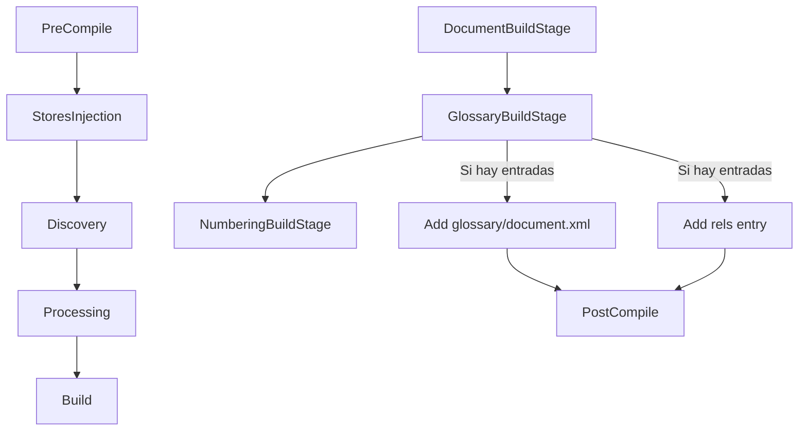

# Plan: Implementación del Glossary Store y Stage

## 1. Visión General

Crear un sistema para gestionar **placeholders del glosario** que permita:
1. Registrar entradas de glosario (nombre, tipo, contenido)
2. Generar el archivo `word/glossary/document.xml`
3. Añadir la relación en `document.xml.rels`
4. Referenciar placeholders desde SDT

---

## 2. Arquitectura Propuesta

```
┌─────────────────────────────────────────────────────────────────┐
│                        DOCX DOCUMENT                             │
│                                                                  │
│  ┌──────────────────────────────────────────────────────────┐   │
│  │                   SDT (Placeholder)                        │   │
│  │                                                          │   │
│  │  <w:sdt>                                                 │   │
│  │    <w:sdtPr>                                             │   │
│  │      <w:placeholder>                                     │   │
│  │        <w:docPart w:val="PlcHdr_Nombre" />  ────────────┼──►│
│  │      </w:placeholder>                                    │   │
│  │    </w:sdtPr>                                            │   │
│  │    <w:sdtContent>...</w:sdtContent>                      │   │
│  │  </w:sdt>                                               │   │
│  └──────────────────────────────────────────────────────────┘   │
│                                                                  │
│                              │                                   │
│                              ▼                                   │
│  ┌──────────────────────────────────────────────────────────┐   │
│  │                   GLOSSARY STORE                           │   │
│  │                                                          │   │
│  │  - _entries: Map<String, GlossaryEntry>                 │   │
│  │  - addEntry(name, type, body)                            │   │
│  │  - buildGlossaryDocument() → XmlComponent                │   │
│  │  - getEntryByName(name) → GlossaryEntry?                 │   │
│  └──────────────────────────────────────────────────────────┘   │
│                                                                  │
│                              │                                   │
│                              ▼                                   │
│  ┌──────────────────────────────────────────────────────────┐   │
│  │              word/glossary/document.xml                   │   │
│  │                                                          │   │
│  │  <w:glossaryDocument>                                    │   │
│  │    <w:docParts>                                          │   │
│  │      <w:docPart>                                         │   │
│  │        <w:docPartPr>                                     │   │
│  │          <w:name w:val="PlcHdr_Nombre" />                │   │
│  │          <w:type w:val="bbPlcHdr" />                     │   │
│  │        </w:docPartPr>                                    │   │
│  │        <w:docPartBody>                                   │   │
│  │          <w:p>...</w:p>                                  │   │
│  │        </w:docPartBody>                                  │   │
│  │      </w:docPart>                                        │   │
│  │    </w:docParts>                                         │   │
│  │  </w:glossaryDocument>                                   │   │
│  └──────────────────────────────────────────────────────────┘   │
└─────────────────────────────────────────────────────────────────┘
```

---

## 3. Componentes a Crear

### 3.1 Tipos de Datos

```dart
// lib/src/docx_sdk/components/data/glossary/glossary_entry.dart

enum GlossaryEntryType {
  placeholder,    // bbPlcHdr
  autoText,        // bbAutoText
  normal,          // bbNormal
  customAutoText,  // bbCustomAutoText
}

class GlossaryEntry {
  final String name;              // Nombre único (w:name)
  final GlossaryEntryType type;   // Tipo de entrada
  final String? category;         // Categoría (opcional)
  final String? description;      // Descripción (opcional)
  final List<DocxNode> body;      // Contenido del docPartBody
  
  // Constructor, métodos, etc.
}
```

### 3.2 GlossaryStore

```dart
// lib/src/docx_sdk/stores/glossary_store.dart

class GlossaryStore extends Store {
  final Map<String, GlossaryEntry> _entries = {};
  
  // Métodos:
  // - addEntry(GlossaryEntry entry)
  // - removeEntry(String name)
  // - getEntry(String name) → GlossaryEntry?
  // - hasEntry(String name) → bool
  // - buildGlossaryXmlComponent() → XmlGlossaryComponent
  // - discoverGlossaryUsage(DocxNode node) // encontrar SDT con placeholders
}
```

### 3.3 GlossaryProvider (InheritedStore)

```dart
// lib/src/docx_sdk/stores/inherited_stores/glossary_provider.dart

class GlossaryProvider extends InheritedNode {
  final GlossaryStore store;
  
  static GlossaryStore of(DocxNode node) // patrón estándar
}
```

### 3.4 XmlGlossaryComponent

```dart
// lib/src/docx_sdk/xml_components/glossary/xml_glossary_component.dart

class XmlGlossaryComponent extends XmlComponentBase {
  // Build <w:glossaryDocument> con <w:docParts>
}
```

### 3.5 GlossaryBuildStage

```dart
// lib/src/docx_sdk/compiler/pipeline/stages/building/glossary_build_stage.dart

class GlossaryBuildStage extends PipelineStage {
  // Ejecutar en StageCategory.build
  // Orden: después de DocumentBuildStage
  // 1. Verificar si hay entradas en GlossaryStore
  // 2. Si hay entradas:
  //    - Build glossary/document.xml
  //    - Añadir al archive
  //    - Crear relación en document.xml.rels
}
```

---

## 4. Tasks (TODO List)

```markdown
[ ] Crear GlossaryEntryType enum
[ ] Crear clase GlossaryEntry
[ ] Crear GlossaryStore
[ ] Crear GlossaryProvider
[ ] Crear XmlGlossaryComponent
[ ] Crear XmlGlossaryRelsComponent
[ ] Crear GlossaryBuildStage
[ ] Modificar StoresInjectionStage para incluir GlossaryProvider
[ ] Modificar DocumentRelsBuildStage para añadir relación del glosario
[ ] Modificar ContentTypeBuildStage para añadir content type del glosario
[ ] Registrar serialización de GlossaryEntry en DocxRegistry
[ ] Tests unitarios
```

---

## 5. Integración con Pipeline

### Flujo de ejecución:



### Stages a modificar:

| Stage | Modificación |
|-------|--------------|
| `StoresInjectionStage` | Añadir `GlossaryProvider` al árbol |
| `ContentTypeBuildStage` | Añadir Override para `/word/glossary/document.xml` |
| `DocumentRelsBuildStage` | Añadir Relationship para glossary |
| `DocumentBuildStage` | (Sin cambios, SDT ya referencian por nombre) |

---

## 6. API Propuesta

```dart
// Uso por el usuario final

DocxDocument document = DocxDocument();

// Añadir placeholder al glosario
document.glossary.addPlaceholder(
  name: 'PlcHdr_Nombre',
  body: [
    Paragraph(
      children: [
        TextRun(
          text: 'Escriba aquí...',
          styles: [italic, color(gray)]
        )
      ]
    )
  ]
);

// El SDT referenciará por nombre
SdtPlainText placeholder = SdtPlainText(
  placeholder: SdtPlaceholder(
    docPart: 'PlcHdr_Nombre'  // Referencia al glosario
  ),
  child: TextRun(text: ''),
);

// En compile(), se genera automáticamente:
// 1. word/glossary/document.xml
// 2. Relationship en document.xml.rels
// 3. Content-Type override si es necesario
```

---

## 7. Consideraciones Adicionales

### 7.1 Nombre único
- Validar que `name` sea único
- Usar convención: `PlcHdr_{NombreDescriptivo}`

### 7.2 Tipos de behavior
```dart
enum GlossaryBehavior {
  content,     // p - Solo contenido
  page,        // s - Nueva página
  nextPage,    // n - Página siguiente
  paragraphAndPage, // pg - Párrafo + página
}
```

### 7.3 Serialización
- Las entradas del glosario NO son DocxNodes (son datos puros)
- Solo el store necesita serializarse para caché incremental

---

## 8. Archivos a crear

```
lib/src/docx_sdk/
├── stores/
│   ├── glossary_store.dart              [NUEVO]
│   └── inherited_stores/
│       └── glossary_provider.dart       [NUEVO]
├── xml_components/
│   └── glossary/
│       ├── xml_glossary_component.dart  [NUEVO]
│       └── xml_glossary_rels_component.dart [NUEVO]
└── compiler/pipeline/stages/building/
    └── glossary_build_stage.dart        [NUEVO]

lib/src/docx_sdk/components/data/glossary/
├── glossary_entry.dart                  [NUEVO]
└── glossary_enums.dart                  [NUEVO]
```

---

## 9. Prioridad de implementación

1. **Fase 1**: Tipos y modelo de datos
   - `GlossaryEntryType` enum
   - `GlossaryEntry` class

2. **Fase 2**: Store y Provider
   - `GlossaryStore` con métodos básicos
   - `GlossaryProvider`

3. **Fase 3**: Componentes XML
   - `XmlGlossaryComponent`
   - `XmlGlossaryRelsComponent`

4. **Fase 4**: Stage de build
   - `GlossaryBuildStage`
   - Integración en pipeline

5. **Fase 5**: Integración con SDT
   - SDT ya soporta `placeholder` property
   - Verificar que referencia por nombre funcione